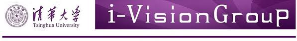
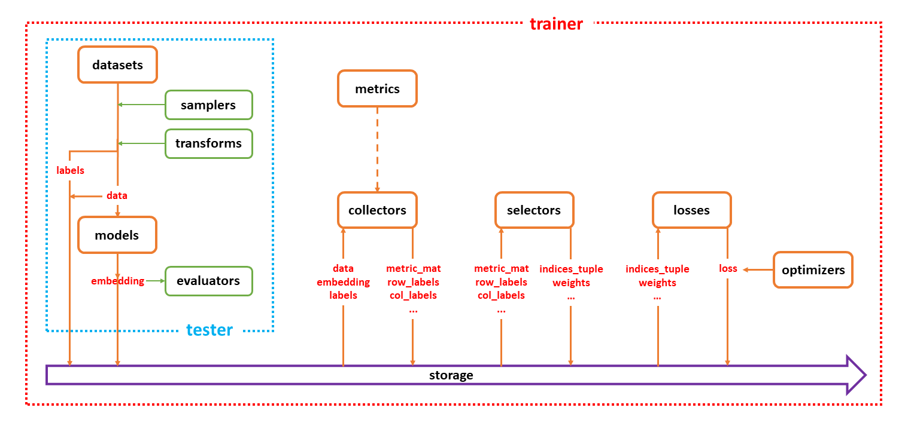

<h1 align="center">
  <a href="http://ivg.au.tsinghua.edu.cn/">
    
  </a>
</h1>

<p align="center">
  <a href="https://badge.fury.io/py/gedml">
    
  </a>
  
  <a href="https://github.com/zbr17/GeDML/blob/master/.github/workflows/sphinx_pages.yml">
    
  </a>
</p>

# News
- **[2021-10-27]**: **`v0.1.4` has been released:
  - ***New features:***
    - Add contrastive representation learning methods (MoCo-V2).
---
- **[2021-10-24]**: **`v0.1.2` has been released:
  - ***New features:***
    - Add distributed (DDP) support.
- **[2021-10-7]**: **`v0.1.1` has been released:
  - ***New features:***
    - Change the Cars196 loading [method](http://ai.stanford.edu/~jkrause/cars/car_dataset.html).
- **[2021-9-15]**: **`v0.1.0` has been released:
  - ***New features:*** 
    - **output_wrapper** and **pipeline setting** are decomposed for convenience.
    - Pipeline will be stored in the experiment folder using a directed graph.
- **[2021-9-13]**: **`v0.0.1` has been released: 
  - ***New features:*** 
    - `config.yaml` will be created to store the configuration in the experiment folder.**
- **[2021-9-6]**: `v0.0.0` has been released.

# Introduction

**GeDML** is an easy-to-use **generalized deep metric learning** library, which contains:
- **State-of-the-art DML algorithms:** We contrain 18+ losses functions and 6+ sampling strategies, and divide these algorithms into three categories (i.e., collectors, selectors, and losses).
- **Bridge bewteen DML and SSL**: We attempt to bridge the gap between deep metric learning and self-supervised learning through specially designed modules, such as `collectors`.
- **Auxiliary modules to assist in building:** We also encapsulates the upper interface for users to start programs quickly and separates the codes and configs for managing hyper-parameters conveniently.

# Installation

## Pip

```bash
pip install gedml
```

# Quickstart

(Demo of convenient and fast switching between DML and SSL)

- If you use the command line, you can run [`sample_run.sh`](examples/sample_run.sh) to try this project.
- If you debug with VS Code, you can refer to [`launch.json`](examples/launch.json) to set `.vscode`.

## Initialization

Use `ParserWithConvert` to get parameters

```python
>>> from gedml.launcher.misc import ParserWithConvert
>>> csv_path = ...
>>> parser = ParserWithConvert(csv_path=csv_path, name="...")
>>> opt, convert_dict = parser.render()
```

Use `ConfigHandler` to create all objects.

```python
>>> from gedml.launcher.creators import ConfigHandler
>>> link_path = ...
>>> assert_path = ...
>>> param_path = ...
>>> wrapper_path = ...
>>> config_handler = ConfigHandler(
    convert_dict=convert_dict,
    link_path=link_path,
    assert_path=assert_path,
    params_path=param_path,
    wrapper_path=wrapper_path,
    is_confirm_first=True
)
>>> config_handler.get_params_dict()
>>> objects_dict = config_handler.create_all()
```

## Start

Use `manager` to automatically call `trainer` and `tester`.

```python
>>> from gedml.launcher.misc import utils
>>> manager = utils.get_default(objects_dict, "managers")
>>> manager.run()
```

Or directly use `trainer` and `tester`.

```python
>>> from gedml.launcher.misc import utils
>>> trainer = utils.get_default(objects_dict, "trainers")
>>> tester = utils.get_default(objects_dict, "testers")
>>> recorder = utils.get_default(objects_dict, "recorders")
# start to train
>>> utils.func_params_mediator(
    [objects_dict],
    trainer.__call__
)
# start to test
>>> metrics = utils.func_params_mediator(
    [
        {"recorders": recorder},
        objects_dict,
    ],
    tester.__call__
)
```

# Framework

This project is modular in design. The pipeline diagram is as follows:

<h1 align="center">
   
</h1>

## Code structure

<!-- - [.docsrc](.docsrc): Code for documentation generation.
- [.github](.github): CI/CD. -->
- [tests](tests): Debug files.
- [examples](examples): Demos.
  - [config](examples/config): Folder which stores [`links`](examples/config/links), [`param`](examples/config/param), [`wrapper`](examples/config/wrapper), [`args.yaml`](examples/config/args.csv) and [`assert.yaml`](examples/config/assert.yaml).
  - [demo.py](examples/demo.py): A demo python file.
- [src/gedml](src/gedml): Main code.
  - [core](src/gedml/core): Losses, selectors, collectors, etc.
  - [client](src/gedml/client): Tmux manager.
  - [config](src/gedml/config): Config files which define the hyper-string etc.
  - [launcher](src/gedml/launcher): Manager, Trainer, Tester, etc.
  - [recorder](src/gedml/recorder): Recorder.

# Method

## Collectors

| method | description |
| ---- | ---- |
| BaseCollector | Base class |
| DefaultCollector | Do nothing |
| ProxyCollector | Maintain a set of proxies |
| MoCoCollector | paper: [Momentum Contrast for Unsupervised Visual Representation Learning](https://openaccess.thecvf.com/content_CVPR_2020/html/He_Momentum_Contrast_for_Unsupervised_Visual_Representation_Learning_CVPR_2020_paper.html) |
| SimSiamCollector | paper: [Exploring Simple Siamese Representation Learning](https://arxiv.org/abs/2011.10566) |
| HDMLCollector | paper: [Hardness-Aware Deep Metric Learning](https://openaccess.thecvf.com/content_CVPR_2019/html/Zheng_Hardness-Aware_Deep_Metric_Learning_CVPR_2019_paper.html) |
| DAMLCollector | paper: [Deep Adversarial Metric Learning](https://openaccess.thecvf.com/content_cvpr_2018/html/Duan_Deep_Adversarial_Metric_CVPR_2018_paper.html) |
| DVMLCollector | paper: [Deep Variational Metric Learning](https://openaccess.thecvf.com/content_ECCV_2018/html/Xudong_Lin_Deep_Variational_Metric_ECCV_2018_paper.html) |

## Losses

### classifier-based

| method | description |
| ---- | ---- |
| CrossEntropyLoss | Cross entropy loss for unsupervised methods |
| LargeMarginSoftmaxLoss | paper: [Large-Margin Softmax Loss for Convolutional Neural Networks](https://www.jmlr.org/proceedings/papers/v48/liud16.pdf) |
| ArcFaceLoss | paper: [ArcFace: Additive Angular Margin Loss for Deep Face Recognition](https://openaccess.thecvf.com/content_CVPR_2019/html/Deng_ArcFace_Additive_Angular_Margin_Loss_for_Deep_Face_Recognition_CVPR_2019_paper.html) |
| CosFaceLoss | paper: [CosFace: Large Margin Cosine Loss for Deep Face Recognition](http://openaccess.thecvf.com/content_cvpr_2018/html/Wang_CosFace_Large_Margin_CVPR_2018_paper.html) |

### pair-based

| method | description |
| ---- | ---- | 
| ContrastiveLoss | paper: [Learning a Similarity Metric Discriminatively, with Application to Face Verification](https://ieeexplore.ieee.org/abstract/document/1467314/) |
| MarginLoss | paper: [Sampling Matters in Deep Embedding Learning](http://openaccess.thecvf.com/content_iccv_2017/html/Wu_Sampling_Matters_in_ICCV_2017_paper.html) |
| TripletLoss | paper: [Learning local feature descriptors with triplets and shallow convolutional neural networks](https://www.researchgate.net/profile/Krystian_Mikolajczyk/publication/317192886_Learning_local_feature_descriptors_with_triplets_and_shallow_convolutional_neural_networks/links/5a038dad0f7e9beb1770c3c2/Learning-local-feature-descriptors-with-triplets-and-shallow-convolutional-neural-networks.pdf) |
| AngularLoss | paper: [Deep Metric Learning with Angular Loss](https://openaccess.thecvf.com/content_iccv_2017/html/Wang_Deep_Metric_Learning_ICCV_2017_paper.html) |
| CircleLoss | paper: [Circle Loss: A Unified Perspective of Pair Similarity Optimization](http://openaccess.thecvf.com/content_CVPR_2020/html/Sun_Circle_Loss_A_Unified_Perspective_of_Pair_Similarity_Optimization_CVPR_2020_paper.html) |
| FastAPLoss | paper: [Deep Metric Learning to Rank](https://openaccess.thecvf.com/content_CVPR_2019/html/Cakir_Deep_Metric_Learning_to_Rank_CVPR_2019_paper.html) |
| LiftedStructureLoss | paper: [Deep Metric Learning via Lifted Structured Feature Embedding](https://www.cv-foundation.org/openaccess/content_cvpr_2016/html/Song_Deep_Metric_Learning_CVPR_2016_paper.html) |
| MultiSimilarityLoss | paper: [Multi-Similarity Loss With General Pair Weighting for Deep Metric Learning](https://openaccess.thecvf.com/content_CVPR_2019/html/Wang_Multi-Similarity_Loss_With_General_Pair_Weighting_for_Deep_Metric_Learning_CVPR_2019_paper.html) |
| NPairLoss | paper: [Improved Deep Metric Learning with Multi-class N-pair Loss Objective](http://www.nec-labs.com/uploads/images/Department-Images/MediaAnalytics/papers/nips16_npairmetriclearning.pdf) |
| SignalToNoiseRatioLoss | paper: [Signal-To-Noise Ratio: A Robust Distance Metric for Deep Metric Learning](https://openaccess.thecvf.com/content_CVPR_2019/html/Yuan_Signal-To-Noise_Ratio_A_Robust_Distance_Metric_for_Deep_Metric_Learning_CVPR_2019_paper.html) |
| PosPairLoss | paper: [Exploring Simple Siamese Representation Learning](https://arxiv.org/abs/2011.10566) |

### proxy-based

| method | description |
| ---- | ---- | 
| ProxyLoss | paper: [No Fuss Distance Metric Learning Using Proxies](https://openaccess.thecvf.com/content_iccv_2017/html/Movshovitz-Attias_No_Fuss_Distance_ICCV_2017_paper.html) |
| ProxyAnchorLoss | paper: [Proxy Anchor Loss for Deep Metric Learning](http://openaccess.thecvf.com/content_CVPR_2020/html/Kim_Proxy_Anchor_Loss_for_Deep_Metric_Learning_CVPR_2020_paper.html) |
| SoftTripleLoss | paper: [SoftTriple Loss: Deep Metric Learning Without Triplet Sampling](https://openaccess.thecvf.com/content_ICCV_2019/html/Qian_SoftTriple_Loss_Deep_Metric_Learning_Without_Triplet_Sampling_ICCV_2019_paper.html) |

## Selectors

| method | description |
| ---- | ---- | 
| BaseSelector | Base class |
| DefaultSelector | Do nothing |
| DenseTripletSelector | Select all triples |
| DensePairSelector | Select all pairs |

# Document 
For more information, please refer to: 

:book: :point_right: [**Docs**](https://zbr17.github.io/GeDML/)

Some specific guidances:

- [How to write config](https://zbr17.github.io/GeDML/config.html#)
- [How to define custom module](https://zbr17.github.io/GeDML/collectors.html)
- ...

## Configs

We will continually update the optimal parameters of different configs in [TsinghuaCloud](https://cloud.tsinghua.edu.cn/d/b753b4559de545b59ddc/)

# Code Reference

- [KevinMusgrave / pytorch-metric-learning](https://github.com/KevinMusgrave/pytorch-metric-learning)
- [KevinMusgrave / powerful-benchmarker](https://github.com/KevinMusgrave/powerful-benchmarker)
- [Confusezius / Deep-Metric-Learning-Baselines](https://github.com/Confusezius/Deep-Metric-Learning-Baselines)
- [facebookresearch / moco](https://github.com/facebookresearch/moco)
- [PatrickHua / SimSiam](https://github.com/PatrickHua/SimSiam)
- [ujjwaltiwari / Deep_Variational_Metric_Learning](https://github.com/ujjwaltiwari/Deep_Variational_Metric_Learning)
- [idstcv / SoftTriple](https://github.com/idstcv/SoftTriple)
- [wzzheng / HDML](https://github.com/wzzheng/HDML)
- [google-research / simclr](https://github.com/google-research/simclr)
- [kunhe / FastAP-metric-learning](https://github.com/kunhe/FastAP-metric-learning)
- [wy1iu / LargeMargin_Softmax_Loss](https://github.com/wy1iu/LargeMargin_Softmax_Loss)
- [tjddus9597 / Proxy-Anchor-CVPR2020](https://github.com/tjddus9597/Proxy-Anchor-CVPR2020)
- [facebookresearch / deit](https://github.com/facebookresearch/deit)

# TODO:
- [ ] assert parameters.
- [ ] write github action to automate unit-test, package publish and docs building.
- [ ] add cross-validation splits protocol.

# Important TODO
- [ ] write `DML` to `SSL` Demos.
- [ ] write complete config (easily run).
- [ ] add moco-v2 demo!!!
- [ ] distributed tester for matrix-form input.
